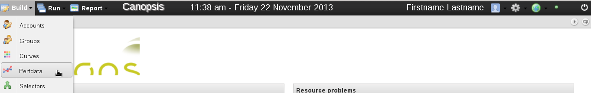
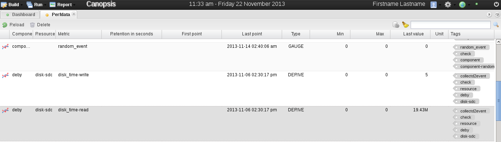

.. include:: ../link.rst

.. _metrics:

Metrics
=======

Metrics are measurement data coming from system pollers thanks to
supervisors or from Canopsis.

An example of poller metric is "system" related to a server cpu loading.
An example of Canopsis metric is "cps\_evt\_per\_sec" and is used to
determinate number of event per second processed by a Canopsis engine.

Even if most metrics are discovered during engine event processing, some
metrics are defined in the Canopsis system. In this case, those metrics
are called internal metrics.

Internal metrics
-----------------

Internal metric are used to monitor Canopsis. Their names start with
"cps\_".

::

        "cps_statechange",
        "cps_statechange_nok",
        "cps_statechange_0",
        "cps_statechange_1",
        "cps_statechange_2",
        "cps_statechange_3",
        "cps_evt_per_sec",
        "cps_state",
        "cps_queue_size",
        "cps_sec_per_evt"

cps\_statechange
~~~~~~~~~~~~~~~~

| State and the various statechange\*
|  The ``cps_statechange`` metric is incremented if a change is detected
between the 4 possibles states:

::

    State "0" is for "ok"           
    State "1" is for "warning"     
    State "2" is for "critical"    
    State "3" is for "unknown"     

So if a given component or resource being monitored change from say,
state 0 to state 1, the Canopsis metric ``cps_statechange`` will be
incremented accordingly.

cps\_statechange\_nok
~~~~~~~~~~~~~~~~~~~~~

The ``cps_statechange_nok`` metric is incremented for any state change
except state 0

cps\_statechange\_0
~~~~~~~~~~~~~~~~~~~

The ``cps_statechange_0`` metric is incremented only if state change to
state 0

cps\_statechange\_1
~~~~~~~~~~~~~~~~~~~

The ``cps_statechange_1`` metric is incremented only if state change to
state 1

cps\_statechange\_2
~~~~~~~~~~~~~~~~~~~

The ``cps_statechange_2`` metric is incremented only if state change to
state 2

cps\_statechange\_3
~~~~~~~~~~~~~~~~~~~

The ``cps_statechange_3`` metric is incremented only if state change to
state 3

Canopsis Engine metrics
-----------------------

These metric are mostly for internal purposes. They yield data used for
tasks such as debugging Canopsis engine for example.

cps\_evt\_per\_sec
~~~~~~~~~~~~~~~~~~

Represent the number of events per seconds

cps\_sec\_per\_evt
~~~~~~~~~~~~~~~~~~

Represent the average time, in seconds, needed to process a single
event.

cps\_queue\_size
~~~~~~~~~~~~~~~~

This is the size of the Canopsis queue

View metric values
------------------

Metric values can be viewed in |widgets| or in the
dedicated view accessible through the Canopsis menu: Build > Perfdata.

|image1|

The view perfdata shows an array of metric values.

|image2|

The array is organized by metric fields depending on the last processed
event.

Just above the array, from left to right, there are reload, delete and
display internals buttons and a research bar surrounded by cancel and
search buttons.

The reload button refresh the view whereas the delete button delete
selected metrics.

The display internals permits to display/hide internal
metrics in the view.

Finally, the research bar waits for simple string values separated by
spaces. Research values are of two types. If they are preceded by the
'#' character, research value concern tag research with same name,
otherwise research value is applied on all metric fields where the value
contains research value.

If several research values are given, then only metrics which match with
all research values will be displayed in the perfdata view.

Here are examples of Research:

-  "cps\_ state" > display all metrics where fields contain "cps\_" and
   "state" values. Some internal metrics match with this filter, but the
   display internal metrics button has to be selected in order to
   display them.
-  "#engine" > display all metrics which contain the tag "engine".
-  "#engine #filter" > display all metrics which contain the tags
   "engine" and "filter". In other word, it's a solution to get all
   metrics from the filter engine .

